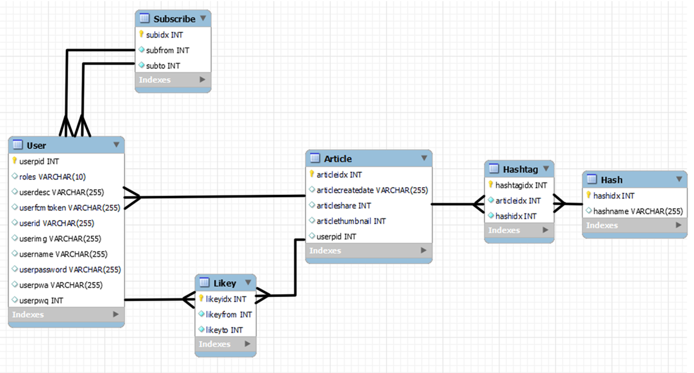

# 하루 담은 필름

  

## 0. 목차

1. [서비스 소개](#1-서비스-소개)
2. [주요 기능](#2-주요-기능)
3. [기술 스택](#3-기술-스택)
4. [시스템 아키텍쳐](#4-시스템-아키텍쳐)
5. [ERD](#5-erd)
6. [팀 구성](#6-팀-구성)
7. [관련 문서](#7-관련-문서)

  

## 1. 서비스 소개

**하루 담은 필름** 은 사진 4장으로 하루를 기록할 수 있는 사진 일기 형식의 안드로이드 SNS 애플리케이션입니다. 저희 서비스는 꾸준히 일기를 쓰고 싶지만 항상 실패하는 사람들을 위해, 쉽게 하루를 기록할 수 있도록 기획되었습니다.  
사용자는 하루에 매일 하나의 "필름"을 기록할 수 있습니다. 필름은 저희 서비스에서 일기와 같은 의미로, 최대 4장의 사진을 촬영해 필름을 채울 수 있습니다. 기록한 필름들은 마이페이지에서 모아볼 수 있으며, 다른 사용자들과 공유하거나 이미지 파일로 기기에 저장할 수 있습니다.

### UCC: [링크](assets/UCC.mp4)

  

## 2. 주요 기능

### 1) 하루 기록하기

- 사용자는 하루 최대 4장의 사진을 촬영할 수 있습니다.
- 촬영 버튼을 누르면, 버튼을 누르기 전 3초 동안의 기록 과정이 함께 저장됩니다.
- 이후 해시 태그를 작성하고, 공개 여부를 선택해서 필름을 완성할 수 있습니다.

 

### 2) 하루 공유하기

- 사용자는 다른 사용자를 팔로우할 수 있습니다. 팔로우한 사용자들의 필름은 피드에서 모아볼 수 있습니다.
- 검색 페이지에서는 검색어가 아이디나 닉네임에 포함된 다른 사용자 및 검색어가 해시태그에 포함된 필름을 검색할 수 있습니다.

 

### 3) 하루 돌아보기

- 필름에 좋아요를 눌러 공감을 표시할 수 있습니다.
- 필름을 재생하면 기록한 과정이 담긴 영상을 차례대로 감상할 수 있습니다.
- 자신이 작성한 필름의 경우, 이미지 파일로 기기에 저장하거나 다른 애플리케이션으로 공유할 수 있습니다.
- 자신이 작성한 필름은 마이페이지에서 모아볼 수 있습니다.

 

### 4) 알림

- 좋아요 알림을 허용한 경우, 자신의 필름에 좋아요가 눌렸을 때 실시간으로 push 알림이 제공됩니다.
- 새 필름 알림을 허용한 경우, 팔로우한 사용자가 새 필름을 올렸을 때 실시간으로 push 알림이 제공됩니다.
- 필름 기록 알림을 허용한 경우, 필름을 아직 기록하지 않았다면 6시, 12시, 18시에 남은 사진 수를 알려주는 push 알림이 제공됩니다.

  

## 3. 기술 스택

| **Part**       | **Stack**                                                                                                                                                                                                                                                                                                                   |
| -------------- | --------------------------------------------------------------------------------------------------------------------------------------------------------------------------------------------------------------------------------------------------------------------------------------------------------------------------- |
| **Android**    |  |
| **Backend**    |                                                                                                             |
| **Deployment** |                                                                                            |

  

## 4. 시스템 아키텍쳐

  

## 5. ERD

  

## 6. 팀 구성

### 1) Android

- 김성민 : 카메라, 피드, 검색, 필름 상세, UI/UX
- 변성도 : 로그인, 마이 페이지, 흔들기, 설정, QA
- 조예지 : 홈, 카메라, 필름 완성, 남은 사진 수 알림, 팀장

 

### 2) Backend

- 김규민 : FCM을 활용한 실시간 좋아요 알림, API 개발
- 김혁주 : 서버 설계 및 API 개발, QA
- 추희원 : 서버 설계 및 API 개발, QA

  

## 7. 관련 문서

- [요구사항 명세서](assets/%EC%82%AC%EC%9A%A9%EC%9E%90%20%ED%9D%90%EB%A6%84%EB%8F%84.pdf)
- [사용자 흐름도](assets/%EC%82%AC%EC%9A%A9%EC%9E%90%20%ED%9D%90%EB%A6%84%EB%8F%84.pdf)
- [시연 시나리오](exec/%EC%8B%9C%EC%97%B0%20%EC%8B%9C%EB%82%98%EB%A6%AC%EC%98%A4.pdf)
- [Android 포팅 매뉴얼](exec/%EC%95%88%EB%93%9C%EB%A1%9C%EC%9D%B4%EB%93%9C%20APK%20%EB%B9%8C%EB%93%9C%20%EA%B3%BC%EC%A0%95.pdf)
- [Backend 포팅 매뉴얼](exec/%EB%B0%B1%EC%97%94%EB%93%9C%20%EC%84%9C%EB%B2%84%20%EB%B0%B0%ED%8F%AC%20%EA%B3%BC%EC%A0%95.pdf)
